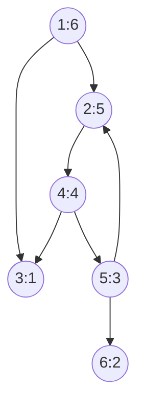

```c++
/*
Copyright 2018 Pierre-Edouard Portier
peportier.me

Licensed under the Apache License, Version 2.0 (the "License");
you may not use this file except in compliance with the License.
You may obtain a copy of the License at

    http://www.apache.org/licenses/LICENSE-2.0

Unless required by applicable law or agreed to in writing, software
distributed under the License is distributed on an "AS IS" BASIS,
WITHOUT WARRANTIES OR CONDITIONS OF ANY KIND, either express or implied.
See the License for the specific language governing permissions and
limitations under the License.
)
*/

```
# Parcours en profondeur (depth-first search)

Répertoire GitHub correspondant à cet article : https://github.com/peportier/ia03-dfs

## Structure LIFO

En utilisant pour $y$ (la structure qui contient les nœuds rencontrés mais dont les successeurs ne sont pas encore calculés, les nœuds gris) une structure de pile LIFO (Last In First Out), nous obtenons le programme
de recherche en profondeur dans un graphe.

```c++
#include <iostream>
#include <vector>
#include <set>
#include <queue>
#include <map>
#include <stack>
#include <functional>
#include <limits>

using namespace std;

struct
node
{
  int val;
  vector< node* > nei;
  node() {};
  node(int i) : val(i) {}
};

typedef function<void(node*)> Visitor;

void
depth( node* src, Visitor f )
{
  set<node*> x; 
  stack< pair< node* , vector<node*>::iterator > > y; 

  y.push( { src, src->nei.begin() } );          // initially the source is grey
  x.insert(src);                                // x contains the black and grey nodes

  while( !y.empty() )                           // while there are still grey nodes...
  {
    node* u = y.top().first;                    // u is the grey node we will make black 
                                                // by exploring his sons

    if( y.top().second != u->nei.end() )        // if u has still unexplored sons
    {
      node* next = *(y.top().second);           // next is a son of u
      ++(y.top().second);

      if( x.end() == x.find(next) )             // if this son of u is white
      {
        y.push( { next, next->nei.begin() } );  // it becomes grey
        x.insert(next);
      }
    }
    else                                        // u has no more unexplored sons.
    {
      f(u);                                     // we can visit u
      y.pop();                                  // u becomes black
    }
  }
}

```

Nous utilisons un visiteur trivial :

```c++
Visitor visit = [](node* v){
  cout << v->val << " ; ";
};

```

## Version récursive

La recherche en profondeur s'écrit plus naturellement sous une forme récursive. La [pile d'exécution](https://fr.wikipedia.org/wiki/Pile_d%27ex%C3%A9cution), cachée au programmeur, remplace la structure de pile `y`.

```c++
void
depthrec0( node* src, Visitor visit, set<node*>& x )
{
  x.insert(src);

  for( node* n : src->nei )
  {
    if( x.end() == x.find(n) )
    {
      depthrec0( n, visit, x );
    }
  }

  visit(src);
}

void
depthrec( node* src, Visitor visit )
{
  set<node*> x;
  depthrec0(src, visit, x);
}
```

Le programme principal teste les deux versions de la recherche en profondeur sur notre exemple.

```c++
int
main()
{
  // example of a graph
  node n1(1); node n2(2); node n3(3);
  node n4(4); node n5(5); node n6(6);
  n1.nei.push_back( &n2 );
  n1.nei.push_back( &n3 );
  n2.nei.push_back( &n4 );
  n4.nei.push_back( &n3 );
  n4.nei.push_back( &n5 );
  n5.nei.push_back( &n2 );
  n5.nei.push_back( &n6 );
  
  depth(&n1, visit); cout << endl;
  depthrec(&n1, visit); cout << endl;
  
  return 0;
}
```

Nous obtenons le résultat attendu.



